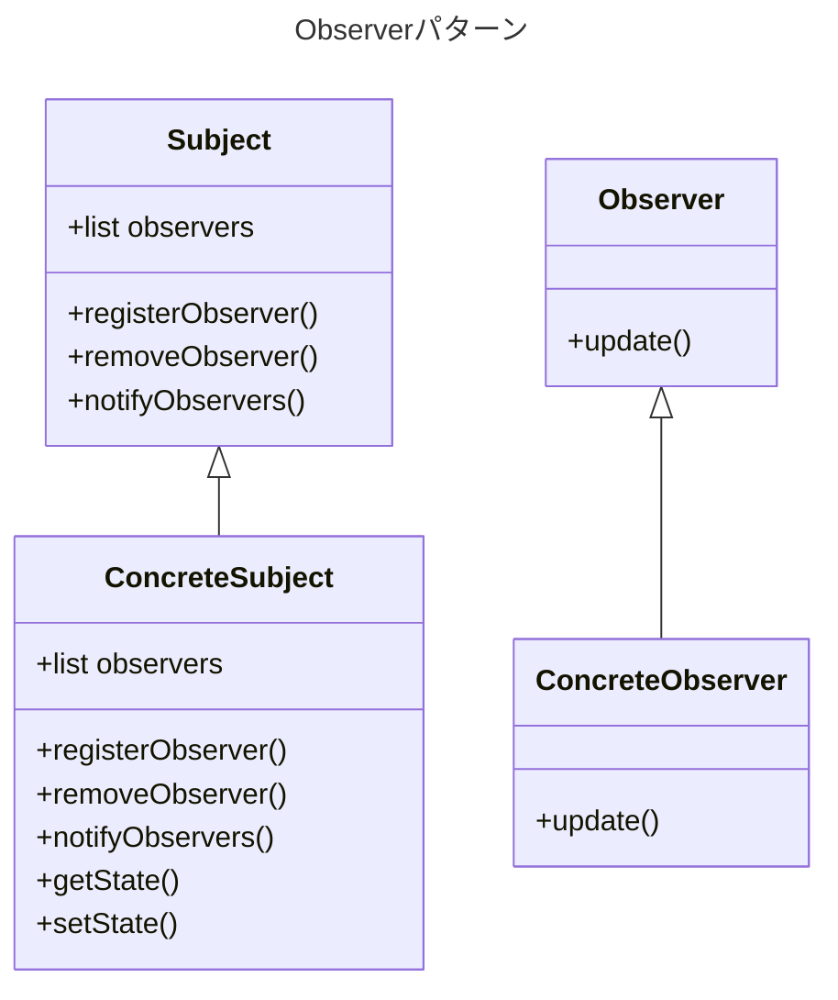

現在取り組んでいるプロジェクトはオブジェクト指向設計を採用しており、復習を兼ねてデザインパターンについての記事を定期的に作成したいと思います。今回は、Observerパターンに焦点を当ててみます

<br>

# 対象読者

- オブジェクト指向に馴染みがある
- 継承、コンポジション、抽象などオブジェクト指向に関する基本的なことを知っている
- Observerパターンについて知りたい or おさらいしておきたい

<br>
<br>

# Observerパターンの概要

あるクラスの変更を検知して、別のクラスに変更を適用したいときによく使用されるデザインパターンです

Observerパターンは**サブジェクト**と**オブザーバー**の2つの役割に分かれます

| サブジェクト | オブザーバー |
| --- | --- |
| 状態の変化をオブザーバーに通知する | サブジェクトからの状態変化通知を受けて処理をする |


<br>

オブザーバーとサブジェクトの関係は、現実世界でもよく見られます。例えば、ショッピングサイトで購入したい商品が品切れの場合、新たに入荷した際に通知を受け取るように設定することができます。


後に商品が入荷したという通知を受けて購入するフローは、Observerパターンだと言えるでしょう


<br>
<br>

    

# クラス図

Observerパターンの基本的なクラス構成は以下の通りです



- Subject
    - Observerのlistをコンポジションとして持ちます。そのためObserverインスタンスを登録する`registerObserver(),` 反対に削除する`removeObserver()`をメソッドとして用意します
    - `notifyObservers()`はSubjectの状態の変化により、実際にObserverに変更を通知するメソッドです
- ConcreteSubject
    - `getState()`、`setState()`はそれぞれオブザーバが監視したい**状態**を取得する、設定するメソッドになります
- Observer, ConcreteObserver
    - `update()`にて通知を受け取った際の処理を実行します


<br>
<br>

# 実例: 気象観測システム

概要やクラス図を見てもイメージが湧きづらい部分もあると思うので、ここでは実際にコードを書いて、より理解を深めてみたいと思います

以下の仕様を満たす「気象観測システム」を、Observerパターンで実装してみます

```plain
概要
- 気象観測システムは現在の気温を監視し、複数の方法を通じてユーザーに最新の気温情報を提供する

要件
- システムは現在の気温を取得し、設定する
- 気温が更新された際に、以下の処理を行う
    - 気温ディスプレイの更新
    - 登録ユーザーにメール送信をする
    - 管理しているウェブサイトに表示する
```

<br>

## SubjectとObserverクラスの作成

まずはそれぞれの親クラスを作成します

- Observer
    
    ```python
    from abc import ABC, abstractmethod
    
    class Observer(ABC):
        @abstractmethod
        def update():
            pass
    ```
    
  Pythonでは、abc.ABCクラスを継承することで、抽象クラスを定義することができます`abstractmethod`をデコレーターとして使用することで抽象メソッドとし、Subjectからの変更通知を受け取るメソッド名を定めています

<br>

- Subject
    
    ```python
    class Subject():
        def __init__(self):
            self.observers = []
    
        def register_observer(self, observer: Observer):
            """オブザーバーを登録する"""
            if observer not in self.observers:
                self.observers.append(observer)
    
        def remove_observer(self, observer: Observer):
            """オブザーバーを削除する"""
            self.observers.remove(observer)
    
        def notify_observers(self):
            """オブザーバーに変更を通知する"""
            for observer in self.observers:
                observer.update()
    ```
    
<br>

## Subjectサブクラスの作成

気象情報を観測するクラスがSubjectサブクラスの対象となります

```python
class WeatherData(Subject):
    """気象観測クラス"""
    def __init__(self):
        super().__init__()
        self._temperature = 0

    def get_temperature(self) -> int:
        """気温を取得する"""
        return self._temperature

    def set_temperature(self, temperature: int):
        """新たな気温を設定する"""
        self._temperature = temperature
        self.notify_observers()
```
- set_temperature
  監視対象となる気温が変更された際に、`notify_observers()`を呼び出し、対象のオブサーバークラスに変更を通知するようにします

<br>


## Observerサブクラスの作成

気温の更新があった際に処理をしたい3つの要件が、そのままObserverサブクラスの対象となります

```python
class Display(Observer):
    """気温表示クラス"""
    def __init__(self, weather_data: WeatherData):
        self.weather_data = weather_data
        weather_data.register_observer(self)

    def update(self):
        """ディスプレイに表示している気温情報を更新する"""
        temperature = self.weather_data.get_temperature()
        print(f'ディスプレイをアップデート - 現在の気温は{temperature}°Cです')

class EmailNotifier(Observer):
    """メール通知クラス"""
    def __init__(self, weather_data: WeatherData):
        self.weather_data = weather_data
        weather_data.register_observer(self)

    def update(self):
        """登録メールアドレスに気温情報を通知する"""
        temperature = self.weather_data.get_temperature()
        print(f'登録メールアドレスに新規気温情報 {temperature}°Cを通知しました')

class WebPortal(Observer):
    """気象情報webサイトクラス"""
    def __init__(self, weather_data: WeatherData):
        self.weather_data = weather_data
        weather_data.register_observer(self)

    def update(self):
        """ウェブサイトに気温情報を表示する"""
        temperature = self.weather_data.get_temperature()
        print(f'ウェブサイトをアップデート - 現在の気温は{temperature}°Cです')
```
どのクラスも初期化の時にWeatherDataを引数に取り、`register_observer()`メソッドを呼び出しています。こうすることでオブザーバーの登録が漏れることを防ぎます

<br>

## 検証

では実際に使用してみましょう。気温を28度に設定してみます

```python
if __name__ == "__main__":
    # 初期化
    weather_data = WeatherData()
    display = Display(weather_data)
    email_notifier = EmailNotifier(weather_data)
    web_portal = WebPortal(weather_data)

    # 気温を28度に設定
    weather_data.set_temperature(28)

#=> ディスプレイをアップデート - 現在の気温は28°Cです
#=> 登録メールアドレスに新規気温情報 28°Cを通知しました
#=> ウェブサイトをアップデート - 現在の気温は28°Cです
```

気温の更新に伴い、オブザーバーの更新処理も実行できていることが確認できます

<br>

新たにメール配信のみ気温更新後の処理対象から外す要望があったと仮定し、その後新しい気温を設定してみます

```python
if __name__ == "__main__":
    # 初期化
    ...

    # 気温を28度に設定
    weather_data.set_temperature(28)

    # メール送信を通知の対象から外す
    weather_data.remove_observer(email_notifier)
    print("""\n-------メール送信をオブザーバーから外しました-------\n""")

    # 気温を23度に設定
    weather_data.set_temperature(23)
 
#=> ディスプレイをアップデート - 現在の気温は28°Cです
#=> 登録メールアドレスに新規気温情報 28°Cを通知しました
#=> ウェブサイトをアップデート - 現在の気温は28°Cです

#=> -------メール送信をオブザーバーから外しました-------

#=> ディスプレイをアップデート - 現在の気温は23°Cです
#=> ウェブサイトをアップデート - 現在の気温は23°Cです
```

メール通知のみ対象から外れ、他の処理は影響なく実行されていることが確認できました

もし新たに通知の対象を増やしたい時は、Observerクラスを継承したクラスを定義するのみでよいため、既存のコードに変更を加えることなく拡張することができます(オープン・クローズドの原則)

<br>
<br>

# まとめ

- 「変更を通知 → 複数の概念の異なる処理を実行したい」という時にObserverパターンは有効
- オープン・クローズドの原則が守られており、仕様変更にも強い
- サブジェクトとオブザーバーの2つの役割がある
    - サブジェクトは状態の変更を通知し、オブザーバーは変更通知を受け取る
- 設計ポイント
    - SubjectはObserverのlistをコンポジションとして持たせる
    - ObserverはSubjectからの変更通知を受け取とるために、更新用の抽象メソッドを定義する

<br>
<br>

# 終わりに

最後まで読んでいただきありがとうございました！

デザインパターンは見ていて楽しく、「なるほどなぁ…」と学びになることばかりなので、他のパターンについても定期的にアウトプットしたいと思います

少しでも記事が参考になりましたら、いいね押していただけると嬉しいです！ありがとうございました！

<br>
<br>

# 参考
- [Head Firstデザインパターン 第2版 - 頭とからだで覚えるデザインパターンの基本](https://www.oreilly.co.jp/books/9784873119762/)