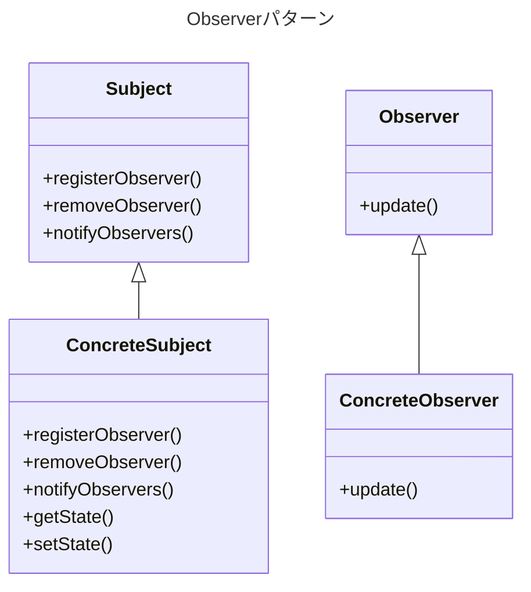

```mermaid
---
title: Observerパターン
---

classDiagram
  direction TB
  class Subject {
     +registerObserver()
     +removeObserver()
     +notifyObservers()
  }
  class ConcreteSubject {
     +registerObserver()
     +removeObserver()
     +notifyObservers()

     +getState()
     +setState()
  }
  class Observer {
    +update()
  }
  class ConcreteObserver {
    +update()
  }
  Subject <|-- ConcreteSubject
  Observer <|-- ConcreteObserver

```