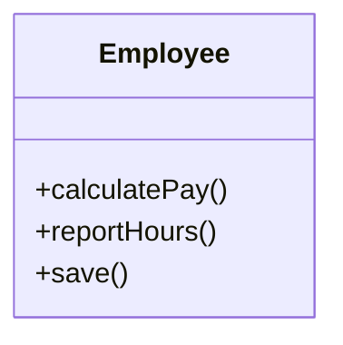
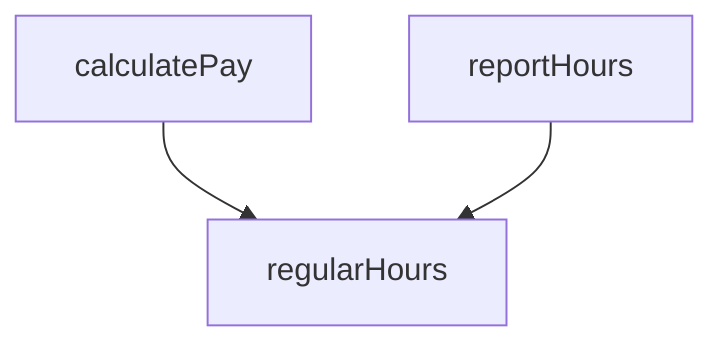
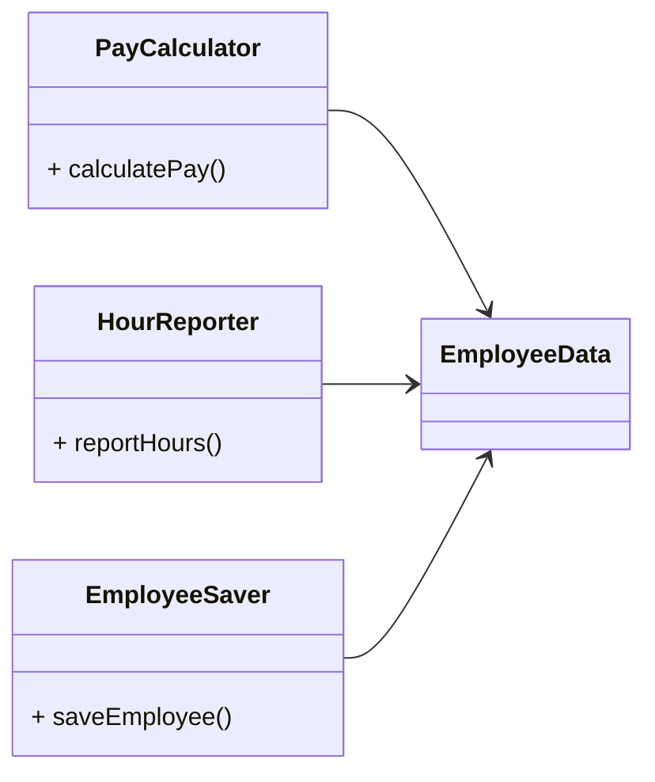
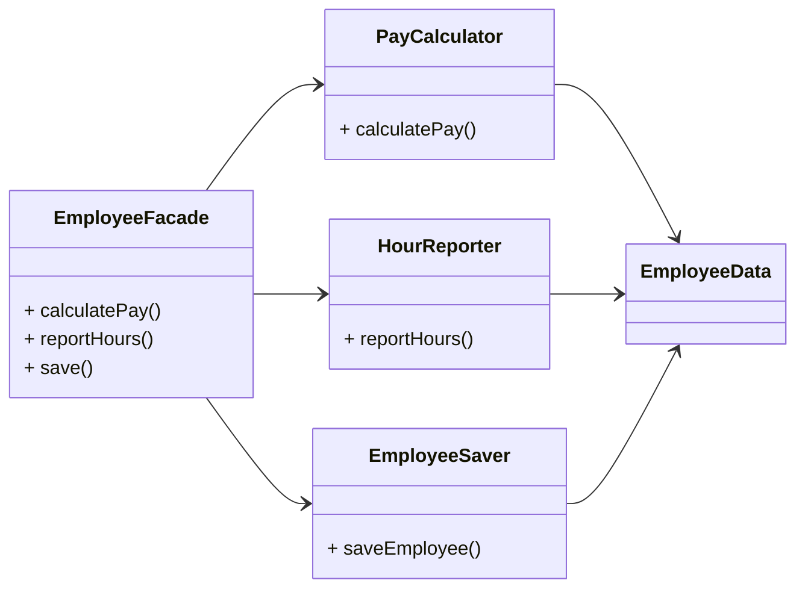

## 前提

---

- 単一責任の原則は「どのモジュールもたった一つのことを行うべき」**ではない**
    
    → こういった原則はあるが、最下位のレベルのものに対して用いるものであり、SOLID原則の単一責任の原則(SRP)とは異なる
    
- かつてSRPは以下のように語られてきた
    
    ```
    モジュールを変更する理由はたったひとつだけであるべきである
    ```
    
- ソフトウェアシステムに手を加えるのはユーザーやステークホルダーを満足させるため
    
    → ユーザーやステークホルダーこそが、SRPの指す「偏光する理由」である。つまり、以下のように言い換えられる
    
    ```
    モジュールはたったひとりのユーザーやステークホルダーに対して責務を負うべきである
    ```
    
- 「たったひとりのユーザーやステークホルダーに対して」という表現は適切ではない。現実には複数のユーザーやステークホルダーがシステムを同じように変更したいと考えることもある。
    
    変更を望む人たちを一つのグループとして「アクター」と呼ぶことにすると、SRPは以下のようになる
    
    <aside>
    💡
    
    モジュールはたった一つのアクターに対して責務を負うべきである
    
    </aside>
    

# 症例1: 想定外の重複

---

## 前提

給与システムにおけるEmployeeクラスがある



- メソッド
    - calculatePay()
        - 経理部門が規定する。報告先はCFO
    - reportHours()
        - 人事部門が規定する。報告先はCOO
    - save()
        - データベース管理者が規定する。報告先はCTO
- 上記メソッドを一つのEmployeeクラスに入れると、開発者はすべてのアクターを結合することになる。

## 本題

### 重複をなくした

calculatePay, reportHoursメソッド両方で、所定労働時間を算出していたとする

- 計算アルゴリズムが同じだったので開発者はコードの重複を嫌い、この部分をregularHoursメソッドに切り出した



### CFOチーム側で改修の必要が出てきた

その後、CFOチームが所定労働時間の算出方法に手を加える必要が出てきた

- 担当者はcalculatePayが、regularHoursを呼び出しているのを確認し、regularHoursを改修した。(regularHoursが、reportHoursからも呼ばれていることは確認できなかった)

### 問題の発覚

COOチームはCFOチーム側の改修を知ることなく、regularHoursから上がってきた数字を活用していた。やがて問題が発覚し、何百万ドルという損害でた

## 問題の原因

- 別々のアクター(CFOチーム、COOチーム、CTOチーム)を一つにまとめてしまったこと
    
    <aside>
    💡
    
    SRPはアクターの異なるコードは分割すべきだという原則である
    
    </aside>
    

# 症例2: マージ

現状だとEmployeeクラスのスキーマを各チームが変更したい場合、変更が衝突することになる。

複数の人たちがそれぞれ別の理由で同じソースファイルを変更することに原因がある

# 解決策

様々な解決策があるが、いずれも関数を別のクラスに移動することは共通している

### 解決策1. データを関数から切り離す



- Employeeクラスはシンプルなデータ構造のみ持ち、メソッドは持たない
- 3つのクラス
    - 特定の機能に必要なソースコードだけを保持
    - 他のクラスについて知ることは許可していない
- デメリット
    - 3つのクラスのインスタンス化して、追跡しなければならない

### 解決策2. Facadeパターン



- [Facade(ファサード)パターン](https://www.notion.so/Facade-d06c6e4c382f43c987fbbb439b1be458?pvs=21)
- EmployeeFacadeは実行したいメソッドを持つ、クラスのインスタンスを生成して、処理を委譲するだけ
    - Ex.
        
        ```python
        class PayCalculator():
        	def calculatePay(self):
        		# 給与計算処理
        
        class EmployeeFacade():
        	def __init__(self, ):
        		self.pay_calculator = PayCalculator()
        
        	def calculatePay(self):
        		self.pay_calculator.calculatePay()
        
        facade = EmployeeFacade()
        facade.calculatePay()
        ```
        
- もし重要なビジネスルールはデータの近くに置きたい場合は、元のEmployeeクラスに必要な処理を残し、重要ではないメソッドをFacadeとして使えば良い
    
    ```mermaid
    
    classDiagram
      direction LR
      class Employee {
        - employeeData
        + calculatePay()
        + reportHours()
        + save()
      }
      class HourReporter {
        + reportHours()
      }
      class EmployeeSaver {
        + saveEmployee()
      }
      Employee --> HourReporter
      Employee --> EmployeeSaver
    ```