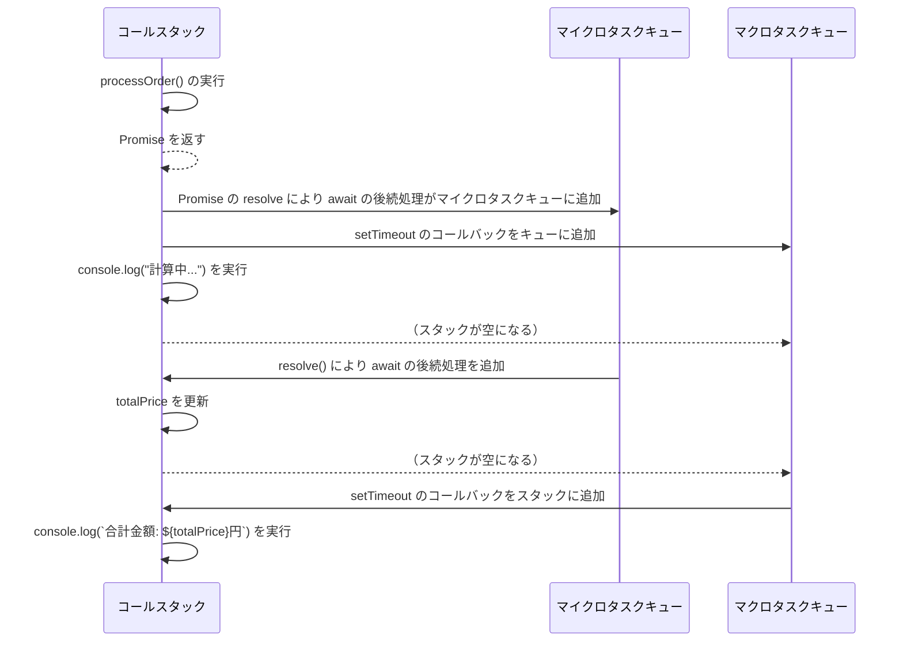

# 初めに

あなたは下記のJavaScriptのコードを見て、どの順番でコンソールに文字が出力されるかわかりますか？

```
setTimeout(() => {
  console.log('setTimeout')
}, 0)

new Promise((resolve, reject) => {
  resolve('promise')
}).then((value) => {
  console.log(value)
})

console.log('hoge')

```

私は`hoge → setTimeout → promise`の順に出力されると思っていましたが、実際は `hoge → promise → setTimeout` の順になります。これを最近知って困惑したので、処理順序について改めて整理してみました。

この記事の対象読者及び触れることについては以下の通りです

## 対象読者

- setTimeoutとpromiseの実行順がよくわからない
- マクロタスク・マイクロタスクの違いを理解していない
- JavaScript の処理順序とレンダリングの関係を知りたい

## 記事で触れること

- イベントループ、スタック、タスクキューについての説明
- 関数の実行とレンダリングのタイミング

# 本題

## イベントループ

- イベントループはJavaScriptのタスク実行の仕組みを管理するものです。MDNには次のような説明があります

> `event loop`という名前は、それが一般的にどのように実装されたかに従って付けられました。これは通常、次のものに似ています。
> 

```jsx
while (queue.waitForMessage()) {
  queue.processNextMessage();
}

```

> `queue.waitForMessage`はもしその時点でメッセージが存在しないのであれば、同期的にメッセージが到着するのを待ちます。
> 
- 上記の説明から分かる通り、イベントループはタスクが来たら実行し、タスクがなければ非同期的に次のタスクを待つ仕組みになっています。優先されるタスクの種類はありますが、まずはこの点を押さえておけば大丈夫です。

## スタック

- 関数の呼び出しはスタックを形成します。
- 同期的な関数呼び出しは即座にスタックにフレームとして追加され実行されます
- 下記のコードの例で見てみましょう
    
    ```jsx
    
    function getCoffeePrice() {
    	const price = 300
    	return price
    }
    
    function processOrder(quantity) {
    	const tax =  0.1
      return getCoffeePrice() * quantity
    }
    
    const quantity = 3
    const totalPrice = processOrder(quantity);
    console.log(`合計金額: ${totalPrice}円`);
    
    // => 合計金額: 900円
    ```
    
    - processOrderを呼び出すと、processOrderのフレーム が作成され、引数quantityとローカル変数taxを含みます
    - processOrder内でgetCoffeePrice()を呼び出すと、getCoffeePriceのフレームがスタックの最上部に追加されます。
        - このフレームには、getCoffeePriceのローカル変数priceが含まれます
    - この時点でスタックの状態は以下のようになります。
        
        ```mermaid
        flowchart TB
            subgraph Table["スタック"]
                GetCoffeePrice[getCoffeePrice]
                ProcessOrder[processOrder]
                Main[メイン]
            end
        ```
        
    - getCoffeePriceが priceを返すと、そのフレームはスタックから削除され、processOrder に戻ります。
    - processOrder の計算が完了し、戻り値が totalPriceに格納されると、processOrder のフレームも削除されます。
    - 最終的に、`console.log("合計金額: 900円")` が実行され、この時点ですべての関数フレームがスタックから削除され、元の状態に戻ります

同期的な関数ではスタックとフレームで動作しますが、非同期処理は次に取り上げるキューが絡んできます。

## キュー

スタックが空になったら、キューからタスクを取り出します。キューには2種類あります。

### マクロタスクキュー

- イベントハンドラや setTimeoutのコールバック処理のタスク(メッセージ)は、マクロタスクキューに入ります。
- このタスクは関連する関数の呼び出し(と最初のスタックフレームの作成)で構成されています。
- 下記のコード例で見てみましょう
    
    ```jsx
    function getCoffeePrice() {
    	...
    	return price
    }
    
    function processOrder(quantity) {
    	...
      return getCoffeePrice() * quantity
    }
    
    const quantity = 3
    const totalPrice = processOrder(quantity);
    
    setTimeout(() => {
      console.log(`合計金額: ${totalPrice}円`)
    }, 0)
    console.log('計算中...')
    
    // => 計算中...
    // => 合計金額: 900円
    ```
    
    - processOrderのスタックフレームが作成されてからtotalPriceに値が返るまではスタックの章と同じ流れです。
    - その後コード上の順序ではsetTimeoutを呼び出していますが、これはマクロタスクキューに入れられ、次の`console.log('計算中...')`の処理を実行します。
    - この時点で同期的な関数呼び出しが全て完了しスタックが空になった後、setTimeoutのタスクをマクロタスクキューから取り出して、`console.log(`合計金額: ${totalPrice}円`)`をスタックに入れて実行します。
    - 流れとしては以下になります
        
        ```mermaid
        sequenceDiagram
            participant Stack as コールスタック
            participant Queue as マクロタスクキュー
        
            Stack->>Stack: processOrder()
            Stack->>Queue: setTimeout()のコールバックをキューに追加
            Stack->>Stack: console.log("計算中...")
            Stack-->>Queue: （スタックが空になる）
            
            Queue->>Stack: setTimeoutのコールバックをスタックに追加
            Stack->>Stack: console.log(`合計金額: ${totalPrice}円`)
        ```
        
    

### マイクロタスクキュー

- Promise の `.then()` や `await` 以降の処理はマイクロタスクキューに入ります。
- マイクロタスクキューは、現在の同期的なコード（コールスタック内の処理）がすべて完了した後に実行されます。またマイクロタスクキューの処理は、マクロタスクキューよりも優先されます。
    - ここでいう優先とは **「マイクロタスクキュー内のすべての処理が完了した後に、マクロタスクキューから次のタスクを実行」** という意味です。
- コード例
    
    ```jsx
    function getCoffeePrice() {
        return 300;
    }
    
    function processOrder(quantity) {
        return new Promise((resolve) => {
            const tax = 0.1;
            const totalPrice = getCoffeePrice() * quantity;
            resolve(totalPrice + totalPrice * tax);
        });
    }
    
    async function promiseFunc() {
        try {
            const quantity = 3;
            totalPrice = await processOrder(quantity); // `totalPrice` を更新
        } catch (e) {
            throw e;
        }
    }
    
    let totalPrice = 0;
    
    setTimeout(() => {
        console.log(`合計金額: ${totalPrice}円`);
    }, 0);
    
    promiseFunc();
    console.log("計算中...");
    
    // => 計算中...
    // => 合計金額: 990円
    ```
    
    - processOrder(quantity)がPromiseを返し、resolveが実行された時点でawaitの後続処理(totalPriceの更新)がマイクロタスクキューに追加されます。
    - setTimeout()のコールバックはマクロタスクキューに入ります
    - 同期的な処理`console.log("計算中...")`が実行後、マイクロタスクキューの処理(totalPriceの更新)が実行されます
    - 最後にマクロタスクキューのsetTimeoutの処理が実行され、totalPriceの値が出力されます



## 関数の実行とレンダリング