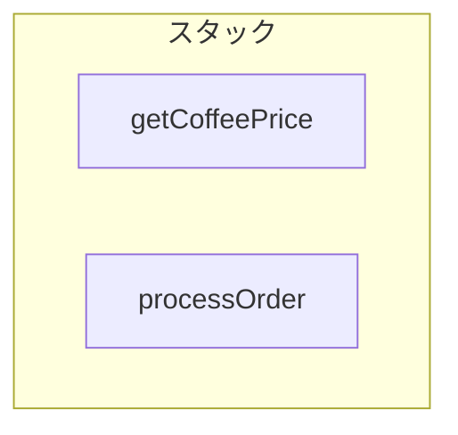
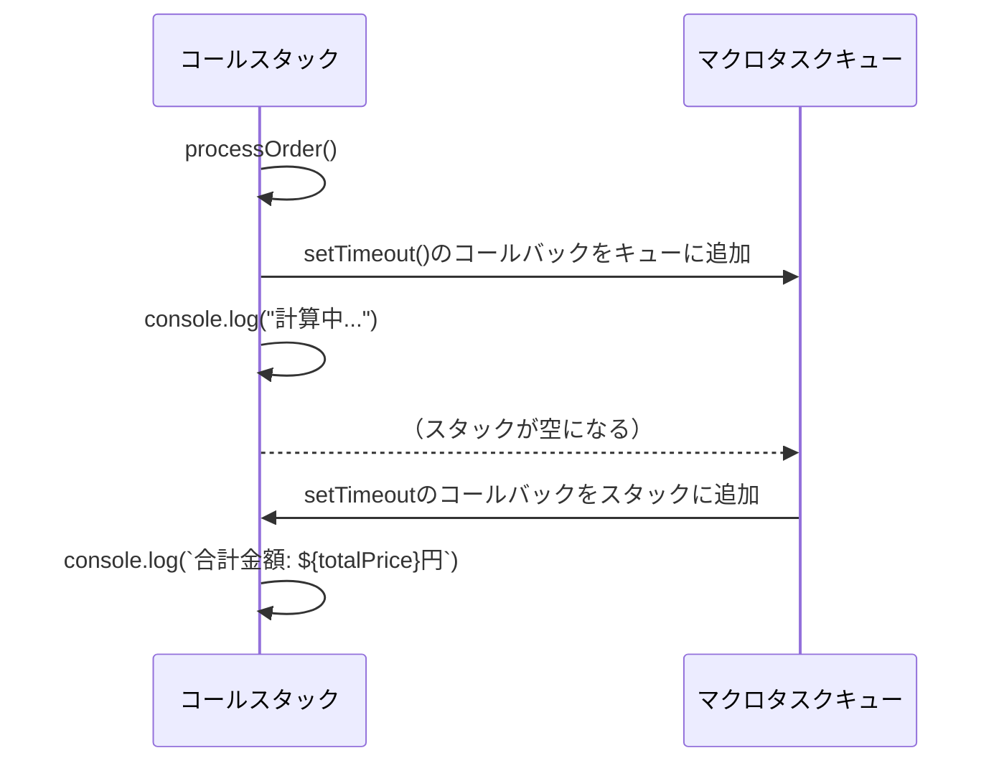
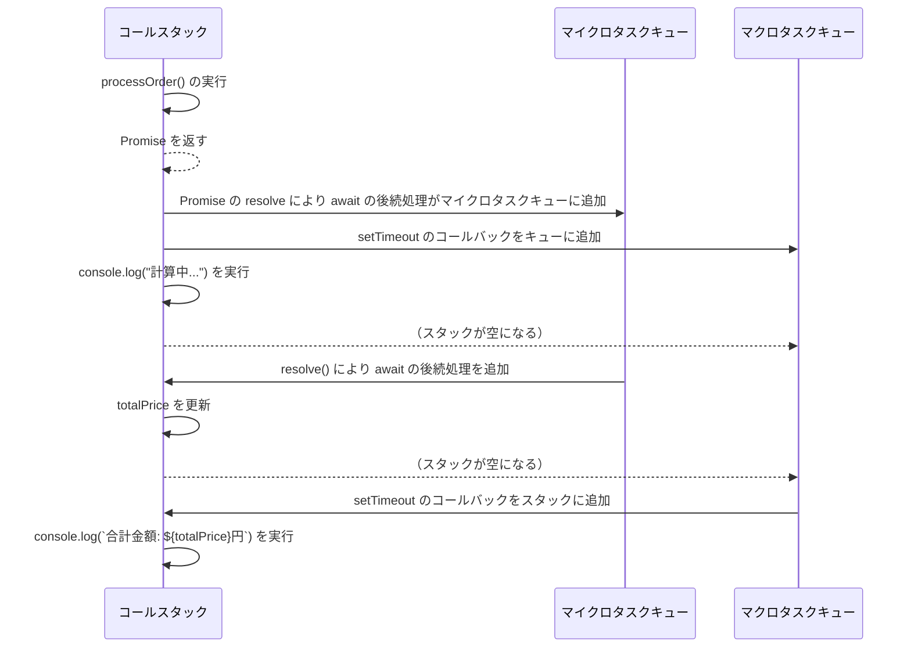

## はじめに

あなたは下記のJavaScriptのコードを見て、どの順番でコンソールに文字が出力されるかわかりますか？

```javascript
setTimeout(() => {
  console.log('setTimeout')
}, 0)

Promise.resolve().then(() => {
  console.log('Promise')
})

console.log('hoge')
```

私は `hoge → setTimeout → promise` の順に出力されると思っていましたが、実際は `hoge → promise → setTimeout` になります。

これを最近知って困惑したので、実行順序について改めて整理してみました。

### 対象読者

- setTimeoutとpromiseの実行順序がよくわからない
- マクロタスク・マイクロタスクの違いを理解していない
- JavaScriptの関数の実行順序とレンダリングの関係を知りたい

### 記事で触れること

- イベントループ、スタック、タスクキューについての説明
- 関数の実行とレンダリングのタイミング

<br>

## 本題

### イベントループ

イベントループはJavaScriptのタスク実行の仕組みを管理するものです。MDNには次のような説明があります

> `event loop`という名前は、それが一般的にどのように実装されたかに従って付けられました。これは通常、次のものに似ています。
> 

```jsx
while (queue.waitForMessage()) {
  queue.processNextMessage();
}

```

> `queue.waitForMessage`はもしその時点でメッセージが存在しないのであれば、同期的にメッセージが到着するのを待ちます。
> 

上記の説明から分かる通り、イベントループはタスクが来たら実行し、タスクがなければ次のタスクを待つ仕組みになっています。優先されるタスクの種類はありますが、まずはこの点を押さえておけば大丈夫です。

<br>

### スタック

関数の呼び出しはスタックを形成します。同期的な関数呼び出しは即座にスタックにフレームとして追加され実行されます。

下記のコードの例を見てみましょう

```jsx
function getCoffeePrice() {
  return 300
}

function processOrder(quantity) {
  const tax = 0.1
  const totalPrice = getCoffeePrice() * quantity
  return totalPrice + totalPrice * tax
}


const quantity = 3;
const totalPrice = processOrder(quantity);
console.log(`合計金額: ${totalPrice}円`);

// => 合計金額: 900円
```

- processOrderを呼び出すと、processOrderのフレーム が作成され、引数quantityとローカル変数taxを含みます
- processOrder内でgetCoffeePrice()を呼び出すと、getCoffeePriceのフレームがスタックの最上部に追加されます。

この時点でスタックの状態は以下のようになります。



- getCoffeePriceが`300`を返すと、そのフレームはスタックから削除され、processOrder に戻ります。
- processOrderの計算が完了し、戻り値が totalPriceに格納されると、processOrder のフレームも削除されます。
- 最終的に、`console.log("合計金額: 900円")` が実行され、この時点ですべての関数フレームがスタックから削除され、元の状態に戻ります
  
同期的な処理はスタックとフレームで動作しますが、非同期処理は次に取り上げるキューが絡んできます。

<br>


### キュー

スタックが空になったら、キューからタスクを取り出します。キューには2種類あります。

#### マクロタスクキュー

**イベントハンドラや setTimeoutのコールバック処理のタスク(メッセージ)は、マクロタスクキューに入ります。** このタスクは関連する関数の呼び出し(と最初のスタックフレームの作成)で構成されています。

下記のコード例で見てみましょう
    
```jsx
function getCoffeePrice() {
  return 300
}

function processOrder(quantity) {
  ...
  return totalPrice + totalPrice * tax
}


const quantity = 3
const totalPrice = processOrder(quantity);

setTimeout(() => {
  console.log(`合計金額: ${totalPrice}円`)
}, 0)
console.log('計算中...')

// => 計算中...
// => 合計金額: 900円
```
    
processOrderのスタックフレームが作成されてからtotalPriceに値が返るまではスタックの章と同じ流れです。
その後コード上の順序ではsetTimeoutを呼び出していますが、これはマクロタスクキューに入れられ、次の`console.log('計算中...')`の処理を実行します。
この時点で同期的な関数呼び出しが全て完了しスタックが空になった後、setTimeoutのタスクをマクロタスクキューから取り出して、 ``console.log(`合計金額: ${totalPrice}円`)`` をスタックに入れて実行します。

流れとしては以下になります
        

        
<br> 

#### マイクロタスクキュー

Promise の `.then()` や `await` 以降の処理はマイクロタスクキューに入ります。

**マイクロタスクキューは、マクロタスクキューよりも優先されます。**
ここでいう優先とは、「**マイクロタスクキューの処理がすべて終わった後に、次のマクロタスクが実行される**」というルールを指します。

こちらもコード例を見てみましょう
    
```jsx
function getCoffeePrice() {
    return 300
}

function processOrder(quantity) {
    return new Promise((resolve) => {
        const tax = 0.1
        const totalPrice = getCoffeePrice() * quantity
        resolve(totalPrice + totalPrice * tax)
    });
}

async function promiseFunc() {
    try {
        const quantity = 3
        totalPrice = await processOrder(quantity)
    } catch (e) {
        throw e
    }
}

let totalPrice = 0

setTimeout(() => {
    console.log(`合計金額: ${totalPrice}円`)
}, 0);

promiseFunc()
console.log("計算中...")

// => 計算中...
// => 合計金額: 990円
```
    
- processOrder(quantity)がPromiseを返し、resolveが実行された時点でawaitの後続処理(totalPriceの更新)がマイクロタスクキューに追加されます。
- setTimeout()のコールバックはマクロタスクキューに入ります
- 同期的な処理`console.log("計算中...")`が実行後、マイクロタスクキューの処理(totalPriceの更新)が実行されます
- 最後にマクロタスクキューのsetTimeoutの処理が実行され、totalPriceの値が出力されます



<br>

### 関数の実行とレンダリング

関数の実行順序においては先述の通りですが、レンダリングはどのタイミングで実行されるのでしょうか

レンダリングのタイミングにおいては下記のポイントを押さえておくと良いと思います
- タスクの実行中はレンダリングされない
- マクロタスク間にレンダリングが実行されることがある
  - ブラウザのレンダリング（約16.7msごと）とのタイミングが合わず、短時間に連続してマクロタスクが実行されると、レンダリングがスキップされることがあります（最適化による影響）
- マイクロタスクの全ての処理が完了した後にレンダリングされる

<br>

こちらもコード例で見てましょう
#### Ex. マクロタスクとレンダリング
```html
<body>
  <p id="count">countの値: 0</p>
  <script>
    setTimeout(() => {
      const count = document.getElementById("count")
      count.innerHTML = `countの値: 1`
    }, 100)

    setTimeout(() => {
      const count = document.getElementById("count")
      count.innerHTML = 'countの値: 2'
    }, 200)
  </script>
</body>
```
    
このコードでは、setTimeoutによるマクロタスクを二つ生成しています。

100ミリ秒ずつで更新させてみたところ、Chromeの検証ツールにて一つ目のタスク完了後である``countの値: 1``のスクリーンショットを確認できました。

ただ二つのsetTimeoutのdelayを0に設定すると、先ほどのスクリーンショットは確認できません。これよりマクロタスク間で必ず画面の更新が実施されるわけではなく、**ブラウザのレンダリングとのタイミングに応じてスキップされていること**が分かります。


#### Ex. マイクロタスクとレンダリング
```html
<body>
  <p id="count">countの値: 0</p>
  <script>
    Promise.resolve().then(() => {
      const count = document.getElementById("count")
      count.innerHTML = 'この代入はHTMLに表示されない'
    });

    Promise.resolve().then(() => {
      const count = document.getElementById("count")
      for(let i=0; i < 10**4; i++) {
        count.innerHTML = `countの値: ${i}`
      }
    });
  </script>
</body>
```
    
このコードでは、Promiseによるマイクロタスクを二つ生成しています。
一つ目のマイクロタスクでは、他のマイクロタスクが存在するため画面の変更はされません。
二つ目のマイクロタスクでは、for文でHTMLのcount値の変更をしていますが、タスクの実行中はレンダリングされないため、実際にレンダリングが確認できるのはタスク完了後の`countの値: 9999`のみとなります。
        
<br>

## おわりに

いかがでしたでしょうか？
これまでsetTimeoutやPromiseは「非同期処理」、それ以外は「同期処理」とざっくり認識していましたが、JavaScriptエンジンの内部構造を知ることで **「なぜこの順番で実行されるのか？」** をより明確に理解できたと思います。

この記事が、イベントループやタスクキューの仕組みを整理する手助けになれば幸いです。

最後まで読んでいただき、ありがとうございました！

<br>

## 参考

https://developer.mozilla.org/ja/docs/Web/JavaScript/Event_loop#%E3%82%A4%E3%83%99%E3%83%B3%E3%83%88%E3%83%AB%E3%83%BC%E3%83%97

https://developer.mozilla.org/ja/docs/Web/Performance/Guides/Animation_performance_and_frame_rate

https://ja.javascript.info/event-loop